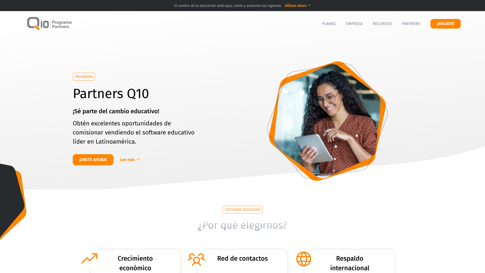

# Programa Partners Q10

> Solución Prueba Técnica para Cargo Desarrollador Frontend - Q10

Este proyecto se realizó completamente de manera nativa.

## Especificaciones Técnicas

- HTML
- CSS
- JavaScript Nativo

## Caracteristicas

- Diseño responsive
- Slider (Construido con JavaScript puro)

## Metodologías

- Modelo BEM

## Live Link

- [Github Pages](https://sebastianvarelag.github.io/technical-test-q10/)

## Desarrollo

- [VSCode](https://code.visualstudio.com/)

## Autor

👨🏻‍💻 **Sebastián Varela Giraldo**

- Linkedin: [Linkedin](https://www.linkedin.com/in/sebastianvarelag/)
- GitHub: [@sebastianvarelag](https://github.com/sebastianvarelag)